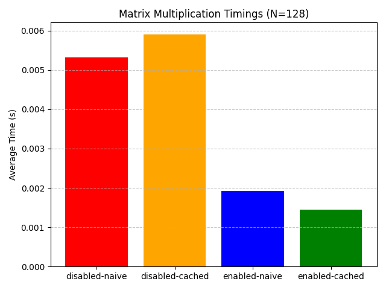
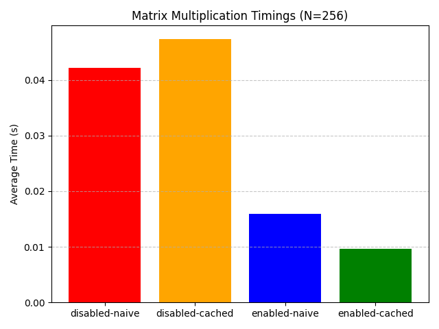
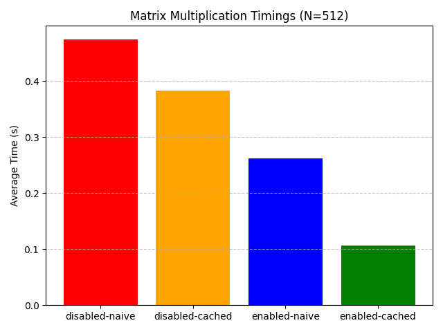
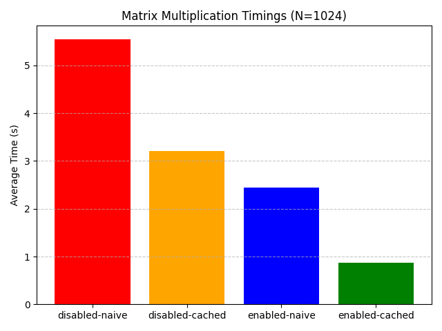
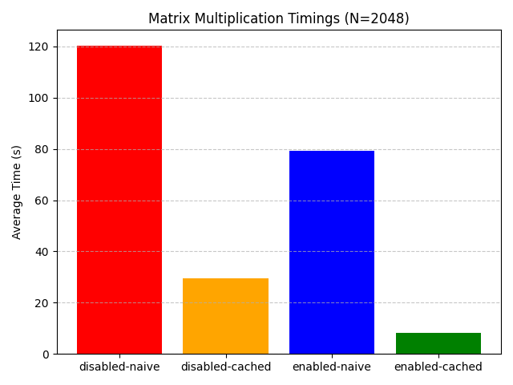

# 👨🏻‍💻 Matrix Multiplication Performance Benchmark

This project benchmarks naïve and cache-aware (tiled) matrix multiplication in C, with optional vectorization support.
It measures performance for various matrix sizes and parameters, then logs results to a CSV file for further analysis.

## 📝 Overview

Matrix multiplication can be implemented in different ways with varying performance characteristics.

1. **Naïve method** – straightforward triple-nested loops, poor cache usage.
2. **Cache-aware (tiled) method** – divides the problem into smaller blocks to exploit spatial and temporal locality, reducing cache misses.

The program:

- Determines an optimal block size automatically based on your L1 data cache size.
- Supports aligned memory allocation for vectorized performance.
- Can run in vectorized or non-vectorized mode (controlled at compile time).
- Outputs timing results in both console and `timings.csv`.

## 👀 Why cache-tiling?

The Naïve method relies on a triple-nested loop which accesses memory according to the formula:
```
C[i][j] += A[i][k] * B[k][j];
```
where
- A[i][k]: ✅ good cache behavior (row-wise memory access)
- B[k][j]: ⚠️ bad cache behavior (column-wise memory access)

In row-wise memory access, the elements are likely to exist in the cache which leads to higher cache hit rates, whereas in column-wise memory access,
cache misses occur which requires a new cache line to be fetched from main memory. This results in a drop in performance.

To overcome the poor cache behavior in the naïve approach, the cache-tiling method is used.
In this method, each matrix is divided into smaller submatrices (called tiles or blocks).
Matrix multiplication is then performed on these blocks so that the data for A, B, and C involved in each partial multiplication step remains in the CPU cache for as long as possible before eviction.

By processing a block of A against a block of B to update the corresponding block of C, we reduce the frequency of cache misses caused by repeatedly fetching distant elements from memory.
The intermediate sums computed for each block are accumulated, and when all blocks have been processed, the final result matrix is obtained.

This block-based approach increases spatial locality (accessing adjacent memory locations) and temporal locality (reusing the same data multiple times while it’s still cached),
significantly improving performance for large matrices that do not fit entirely in cache.

However, the Naïve method works faster than the Cache-aware method when it comes to smaller matrices.

## 🎯 Determining the block size

The block size is chosen to maximize cache utilization by ensuring that the data involved in each block multiplication fits within the CPU’s L1 data cache.
Specifically, for each block multiplication step, we load three blocks into cache simultaneously: one block from matrix A, one from B, and one from C.
Each block is a square submatrix of size blockSize × blockSize, and each element is a double (typically 8 bytes).
Therefore, the total memory footprint for these three blocks is approximately:

$$
\Huge
3 \times (\text{blockSize})^2 \times \text{sizeof(double)}
$$

This memory footprint must be less than or equal to the L1 data cache size

$$
\Huge
3 \times \text{blockSize}^2 \times 8 \leq L_1
$$

Solving for blockSize, we get:

$$
\Huge
\text{blockSize} \leq \sqrt{\left(\frac{L_1}{24}\right)}
$$

## 📊 Benchmark Plots
### Matrix Dimension (N) = 128

### Matrix Dimension (N) = 256

### Matrix Dimension (N) = 512

### Matrix Dimension (N) = 1024

### Matrix Dimension(N) = 2048


## ⚙️ Usage
### Build the program:
Default (vectorization: disabled)

```
make
```

Specify vectorization enabled/disabled

```
make VEC=enabled    # Enable vectorization
make VEC=disabled   # Disable vectorization
```

### Run the program
Default (N: 2048, repetition: 1)

```
./matrixmul
```

Specify Matrix Dimension N (repetition: 1)

```
./matrixmul [N]
```

Specify Matrix Dimension N & repetition

```
./matrixmul [N] [repetition]
```

### Run the benchmarking script
You don't need to `Build the program` prior to this as `./benchmark.sh` automates the build to test different parameters.
```
./benchmark.sh
```
The script can take anywhere from 20-40 minutes to complete depending on the system specifications.

### Plotting the benchmarks
You need to ```Run the benchmarking script``` before this.
```
python3 -m venv venv
source venv/bin/activate
pip install matplotlib pandas
python3 plot_timings.py
```

## 💻⚙️ System Specifications

The results present under `benchmarks` folder were generated on the following configuration:
- `OS`: Ubuntu 24.04.2 LTS x86_64
- `Kernel`: 6.14.0-24-generic
- `CPU`: 12th Gen Intel i5-1235U (12) @ 4.400GHz
- `Memory`: 15716MiB (16GB RAM)
- `Power Mode`: Performance
